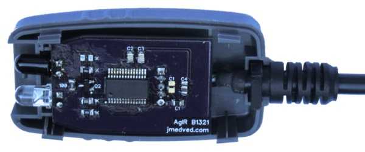

### AgIR ###

Those with Agilent USB to IR (U1173A) cable know that it uses obsoleted
PL-2303HXA chip. In practice this means a lot if you have Windows 8 because
there are no drivers for them. Good thing is that cable has a case that can be
easily opened and communication board can be replaced.

This board is a direct replacement for the one found in the U1173A. It has
FT232RL IC to allow support for anything an everything. Whether it is Windows
98, Windows 8, MaxOS, or Linux this chip is perfectly supported.

PS: Yes, this design is useless if you don't have original Agilent's cable
since it fits only in existing Agilent U1173A case.

#### Usage ####

Open the Agilent U1173A case (a bit of force is ok) and unplug the USB cable.
In the place of existing board place AgIR and connect USB cable to it. Snap the
case shut ([YouTube video](https://www.youtube.com/watch?v=kiC8dzj7aTg)).

Software will recognize cable in same manner as if it is Agilent's own.

#### Schematics ####

#### Manufacturing ####

If you want to make this board your self, just download latest release and send
it over to [OSH Park](http://oshpark.com/) (or any other PCB manufacturer of
your choice).

Inside the archive you will also find parts list.

#### Troubleshooting ####

My first suggestion would be to (temporarily) connect two resistor pads closest
to the FTDI chip (essentially connecting RX and TX together). Then use some
terminal program (e.g. Putty) to determine whether characters are properly
echoed. If yes, this will prove that FTDI works correctly (you might want to
keep phototransistor in dark for this - black isolating tape is good).

To check whether data receiving works, plug it in multimeter and turn knob
around (on multimeter, leave your own knob alone). If you see asterisk (\*)
followed by number (e.g. `*1`), phototransitor is ok.

Last step is to check whether diode works. For that purpose use terminal
program and send `*IDN?``<Alt+010>`. That should result in your product
information response from your multimeter or `*E` if you missed a char or two.

Terminal settings for serial port are 9800,N,8,1.

#### Other projects ####

You can check my other projects at [www.jmedved.com](http://www.jmedved.com/electronics/).
